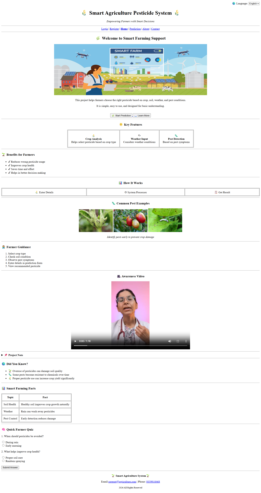
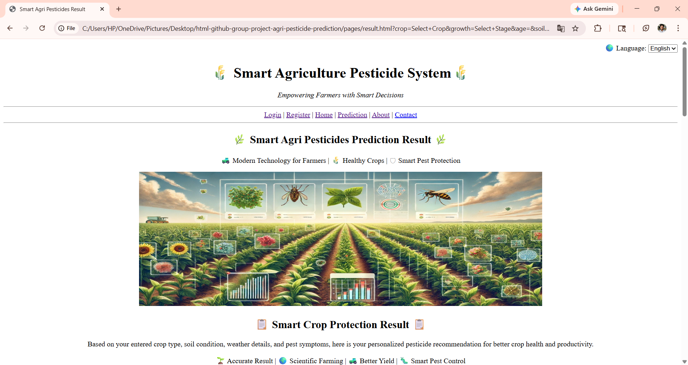

# 🌾 Smart Agriculture Pesticide Prediction System
 
## 🌱 Introduction
 
This project is a simple web-based system developed to support farmers in selecting suitable pesticides for their crops.
 
In real farming situations, choosing the correct pesticide is not always easy. Many farmers depend on guesswork or local advice, which can sometimes lead to crop damage or overuse of chemicals.  

This project is an attempt to solve that problem in a basic way using a structured input system.
 
---
 
## 💡 Project Idea
 
The main idea behind this system is to:
 
- Take important farming inputs (crop, soil, weather, pest)

- Process them in a simple way

- Show a recommended pesticide solution
 
This is currently a **static prototype**, created to demonstrate how such a system can work.
 
---
 
## 🛠️ Technology Used
 
- HTML5 (Pure HTML only)
 
No CSS or JavaScript has been used yet, as the focus of this project is on structure and functionality.
 
---
 
## 📄 Pages Included
 
The project contains the following pages:
 
- Login Page  

- Registration Page  

- Home Page  

- Prediction Page (Main functionality)  

- Result Page  

- About Page  

- Contact Page  
 
All pages are connected using navigation links.
 
---
 
## ⚙️ Working of the System
 
1. User opens the **Prediction page**

2. Enters details such as:

   - Crop type  

   - Crop growth stage  

   - Soil type and moisture  

   - Weather condition  

   - Pest type and severity  
 
3. Clicks on **"Predict Pesticide"**

4. The system processes the input (static logic)

5. User is redirected to the **Result page**

6. The result page displays:

   - Entered data summary  

   - Recommended pesticide  

   - Dosage and usage instructions  

   - Safety precautions  
 
---
 
## 🌟 Features
 
- Structured input form for prediction  

- Clear step-by-step user guidance  

- Separate result display page  

- Use of images, tables, video, and form elements  

- Simple and easy navigation  
 
---
 
## ⚠️ Limitations
 
- No real prediction logic (static output)  

- No database or backend  

- Login/Register is only for design (not functional)  

- Does not use real-time agricultural data  
 
---
 
## 🚀 Future Scope
 
This project can be improved by:
 
- Adding CSS for better design  

- Using JavaScript for dynamic results  

- Connecting backend for real data processing  

- Integrating weather API  

- Making it mobile-friendly  
 
---
 
## 👥 Team Members
 
- Shubham Sharnagate 

- Prajakta Dharpure   

- Kaweri Harinkhede  

- Pranali Shende  

- Sakshi Nagade  

- Kalyani Gadhe  
 
---
 
## 👥 Contributors
 
<a href="https://github.com/shubhamsharnagate">

</a>

 
---
 
## 📷 Project Preview

[

 
 
---
 
## 📞 Contact

Email: support@agriculture.com  

Phone: 9359910468
 
---
 
## 📌 Note
 
This project is developed for academic purposes.  

It focuses on understanding HTML, page linking, and basic project structure.
 