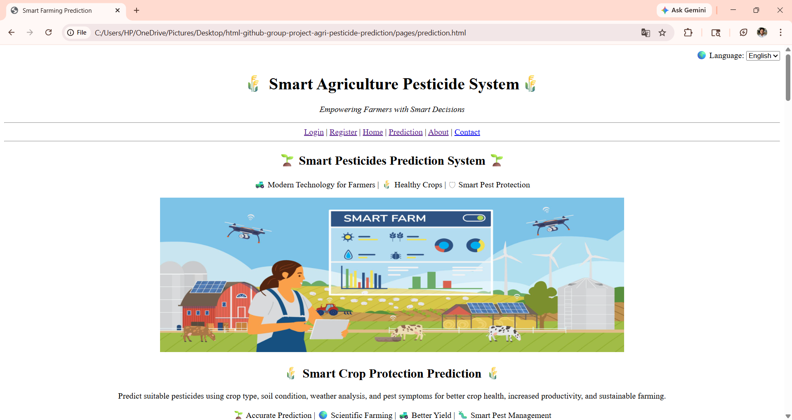

# 🌾 Smart Agriculture Pesticide Prediction System

## 📌 Project Description
This project is a basic web application developed using HTML.  
It helps farmers select suitable pesticides based on crop type, soil condition, weather, and pest details.

The system provides a simple interface where users can enter information and view pesticide recommendations along with safety guidelines.

---

## 🎯 Objective
- Help farmers choose the correct pesticide  
- Reduce crop damage  
- Improve agricultural productivity  
- Promote safe farming practices  

---

## 🛠 Technologies Used
- HTML5

---

## 📄 Pages Implemented
1. Login Page  
2. Registration Page  
3. Home Page  
4. Prediction Page  
5. Result Page  
6. About Page  
7. Contact Page  

---

## ⚙️ How It Works
1. Open the Prediction page  
2. Enter crop, soil, weather, and pest details  
3. Click on "Predict Pesticide"  
4. View result on Result page  

---

## 🌟 Features
- Simple and user-friendly interface  
- Navigation using Navbar and Footer  
- Detailed prediction form  
- Pesticide recommendation display  
- Farmer guidance and safety tips  
- Use of images, video, and HTML elements  

---

## 🧪 Limitations
- Static data (no real-time prediction)  
- No backend or database  
- No actual authentication system  

---

## 🚀 Future Scope
- Add JavaScript for dynamic features  
- Add backend integration  
- Use machine learning for prediction  
- Add weather API  

---

## 👥 Team Members
- Prajakta Dharpure
- Shubham Sharnagate
- Kaweri Harinkhede
- Pranali Shende
- Sakshi Nagade
- Kalyani Gadhe

---

## 📷 Project Preview

---

## 📞 Contact
Email: support@agriculture.com  
Phone: 9359910468

---

## 📌 Note
This project is created for academic and competition purposes.